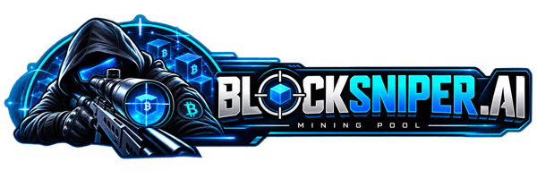
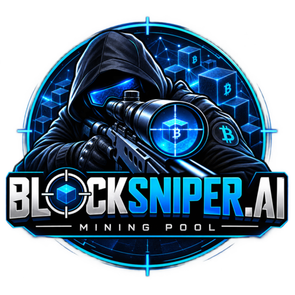

<div align="center">



# BlockSniper.ai — CKPool Fork for Bitcoin Cash

### Open-source **Bitcoin Cash (BCH) mining pool** and **Stratum server** software

**The CKPool fork built for Bitcoin Cash solo mining** — native CashAddr, per-address on-chain
payouts, a configurable operator fee, sub-100 ms multi-node failover, and out-of-the-box
NiceHash / MiningRigRentals compatibility.

[](https://bitcoincash.org)
[](#%EF%B8%8F-architecture)
[](#-production-achievements)
[](src/)
[](COPYING)

**Running in production at [blocksniper.ai](https://blocksniper.ai)** · `stratum+tcp://solo.blocksniper.ai:3333`

> ### 🔄 Formerly **EloPool.cloud** — now **BlockSniper.ai**
> Same fork, same maintainer, same repository, same stratum endpoint. Only the name changed.
> Existing `elopool.cloud` coinbase tags in historical blocks refer to this software.

</div>

---

## 🧭 Why This Fork Instead of Stock CKPool?

If you are searching for **CKPool for Bitcoin Cash**, **BCH pool software**, or a **BCH stratum
server** you can actually put real money behind — this is it. Upstream CKPool is excellent
Bitcoin software, but it is *Bitcoin* software: it does not understand CashAddr, it has no
operator fee mechanism, its node failover takes seconds, and rental services trip over its
difficulty handling.

BlockSniper.ai is a **heavily modified BCH-only fork** that fixes all four, and has **66 blocks
found on BCH mainnet** to show for it.

| You want to… | Stock CKPool | **BlockSniper.ai** |
|---|---|---|
| Let miners use a `bitcoincash:q…` address as their username | ❌ Rejected | ✅ Native CashAddr, all prefixes |
| Pay every miner **on-chain, directly, in the block they found** | ❌ | ✅ Per-address dual-output coinbase |
| Take a pool fee without hacking the source | ❌ Donation code only | ✅ `poolfee`, 0–50%, configurable |
| Survive a node restart without dropping miners | ⚠️ 4+ seconds | ✅ **<100 ms**, sync-aware |
| Accept NiceHash / MiningRigRentals hashrate | ⚠️ Manual, fragile | ✅ Auto-detected by useragent |
| Brand your own coinbase tag | ❌ Hardcoded `ckpool` | ✅ `btcsig`, up to 38 bytes |

**Keywords:** bitcoin cash mining pool software · BCH stratum server · ckpool fork · solo mining
BCH · CashAddr pool · bitcoin cash solo pool · ASIC mining pool · Bitaxe BCH.

---

## 📖 Table of Contents

| Getting Started | Operating the Pool | Reference |
|---|---|---|
| [Why This Fork](#-why-this-fork-instead-of-stock-ckpool) | [Running the Pool](#-running-the-pool) | [What's Different from CKPool](#-whats-different-from-original-ckpool) |
| [Mine to Your Own Address](#-mine-directly-to-your-own-bch-address) | [Multi-Node Configuration](#multi-node-configuration-highly-recommended-for-production) | [Key Features](#-key-features) |
| [Requirements](#-requirements) | [Solo Mode Cutover](#-deploying-solo-mode-cutover) | [Architecture](#%EF%B8%8F-architecture) |
| [Installation](#%EF%B8%8F-installation) | [Monitoring](#monitor-operations) | [API Commands](#-api-commands) |
| [Configuration](#%EF%B8%8F-configuration) | [Troubleshooting](#-troubleshooting) | [Roadmap — Go API](#-roadmap--the-go-log-api) |
| [BCH Node Setup](#-bch-node-setup) | [Testing](#-testing) | [Changelog](#-changelog) |
| [NiceHash & MRR Setup](#-nicehash--miningrigrentals-setup) | [Support the Project](#-support-the-project) | [Contributing](#-contributing) |

---

## 🎯 Mine Directly to Your Own BCH Address

**Solo Mode (-B):** The pool now supports mining directly to your personal BCH address. Each miner is paid on-chain automatically when they find a block, receiving their share minus the pool operator fee.

### How It Works

Simply use your **BCH address as your mining username**:

```bash
# CashAddr format (with prefix) - recommended
./cgminer -o stratum+tcp://pool:3333 -u bitcoincash:qr95sy3j9xwd2ap32xkykttr4cvcu7as4y0qverfuy -p x

# CashAddr format (without prefix)
./cgminer -o stratum+tcp://pool:3333 -u qr95sy3j9xwd2ap32xkykttr4cvcu7as4y0qverfuy -p x

# Legacy Base58 format
./cgminer -o stratum+tcp://pool:3333 -u 1A1z7agoat8Bt8ZVUUxkKvWAWgHtdNi3nn -p x

# Multi-worker mode (add `.workername` or `_workername` suffix)
./cgminer -o stratum+tcp://pool:3333 -u bitcoincash:qr95sy3j9xwd2ap32xkykttr4cvcu7as4y0qverfuy.rig01 -p x
```

### Payment Distribution

When you find a block:
- **98%** goes to your on-chain address automatically
- **2%** (configurable 0–50%) goes to the pool operator as fee

The pool creates a dual-output coinbase transaction splitting the block reward. All outputs sum to the full block reward; if the fee would be dust (<546 sats), the fee output is omitted.

### Smart Fallback & Typo Protection

- **Non-address username** (e.g., `rig01`, `miner1`): You mine for the pool's own address (`bchaddress` config) but keep all rewards
- **Invalid address** (bad checksum/wrong network): You're **rejected immediately** with the message "Invalid BCH address (bad checksum or wrong network) - check your username for typos" — this protects you from accidentally donating a block to a mistyped address

### Network Support

The pool automatically detects your network (mainnet/testnet/regtest) from the BCH node and validates addresses accordingly. CashAddr prefixes must match the network:
- `bitcoincash:` addresses → mainnet
- `bchtest:` addresses → testnet  
- `bchreg:` addresses → regtest

## 🚀 What's Different from Original CKPool?

This is not just a simple fork. BlockSniper.ai has been **extensively modified** for Bitcoin Cash:

| Feature | Original CKPool | BlockSniper.ai |
|---------|----------------|----------|
| **CashAddr Support** | ❌ None | ✅ Native implementation |
| **Pool Fee System** | ❌ Donation only | ✅ Configurable dual-output |
| **Node Failover** | ❌ Slow (40+ failures) | ✅ **Instant (<100ms)** |
| **Sync-Aware Failover** | ❌ No | ✅ **Stays on backup during sync** |
| **Difficulty Management** | Basic vardiff | 3 methods: Password, Useragent, Pattern |
| **Password Difficulty** | ❌ Not supported | ✅ `-p d=X` or `-p diff=X` |
| **Rental Detection** | ❌ Manual config | ✅ Auto-detect via useragent |
| **NiceHash Support** | ❌ Issues | ✅ Full compatibility |
| **MiningRigRentals** | ❌ Issues | ✅ Full compatibility |
| **Share Validation** | Rejects below target | Only rejects below mindiff |
| **BCH Optimizations** | ❌ BTC focused | ✅ BCH specific |
| **Coinbase Message** | Hardcoded "ckpool" | Fully configurable |
| **ZMQ Support** | Limited | Multi-node redundancy |

## 🏆 Production Achievements
- **66 Blocks mined on BCH mainnet** - Proven reliability in production
- **Successfully mining on BCH mainnet** since 2025
- **Battle-tested** with real ASIC hardware (Bitaxe, rental services)
- **Zero share rejections** - Smart validation accepts all valid work
- **Native CashAddr working** - Proven with millions of shares
- **Pool fees working** - Automatic 98/2% split in every block

## 🚀 Key Features

### Core CKPool Features
- **Ultra-low overhead** massively scalable multi-process, multi-threaded architecture
- **Multiple deployment modes**: Pool, Solo, Proxy, Passthrough, Node
- **Seamless restarts** with socket handover for zero-downtime upgrades
- **ASICBoost support** for improved mining efficiency
- **Advanced vardiff** algorithm with stable high-difficulty handling

### BlockSniper.ai Major Enhancements

#### 1. **Pool Operator Fee System** ✅ NEW!
  - Automatic fee distribution in coinbase transaction
  - Dual-output coinbase splitting (miner + pool operator)
  - Configurable percentage (0.0% - 100.0%)
  - **Testnet Verified**: Blocks 1677558 (1% fee), 1677572 (2% fee)
  - Clean implementation without donation code
  - [Full Documentation](POOL_FEE.md)

#### 2. **Native CashAddr Support** ✅
  - Full Bitcoin Cash address format support
  - Zero external dependencies (pure C implementation)
  - Supports all BCH prefixes:
    - `bitcoincash:` (mainnet)
    - `bchtest:` (testnet)
    - `bchreg:` (regtest)
  - Backwards compatible with legacy Base58 addresses
  - **Production Proven**: Successfully mining on mainnet and testnet

#### 3. **Advanced Multi-Difficulty Management** ✅

**Three Methods of Difficulty Control (Priority Order):**

##### a) **Password-Based Difficulty** (Highest Priority) ✅ TESTED
  - Set difficulty via password field: `-p d=500000` or `-p diff=1000000`
  - **Both formats supported**: `d=` (short) and `diff=` (long)
  - Overrides ALL other difficulty settings
  - Applied immediately upon authorization
  - Perfect for individual miner control
  - **Testnet verified**: Successfully tested with `d=41245` on Bitaxe
  - Examples:
    ```bash
    # Short format (tested & working)
    ./bfgminer -o stratum+tcp://pool:3333 -u wallet.worker -p d=500000

    # Long format (also supported)
    ./cgminer -o stratum+tcp://pool:3333 -u wallet.worker -p diff=1000000
    ```

##### b) **Useragent-Based Detection** (Auto-Detection) 🆕
  - **Automatically detects rental services** from mining.subscribe
  - No special configuration needed by miners!
  - Applied immediately during connection
  - Supported services:
    - **NiceHash**: Detects `"NiceHashMiner"` in useragent → 500k diff
    - **MiningRigRentals**: Detects `"MiningRigRentals"` → 1M diff
  - Works exactly like AsicSteer and other modern pools

##### c) **Worker Name Pattern Matching** (Config-Based)
  - Configure patterns in `mindiff_overrides`:
    ```json
    "mindiff_overrides": {
        "nicehash": 500000,      // Matches: wallet.nicehash_rig1
        "MiningRigRentals": 1000000,  // Matches: wallet.MiningRigRentals_xyz
        "bitaxe": 100,           // Matches: wallet.bitaxe_home
        "high": 2000000          // Matches: wallet.high_performance
    }
    ```
  - Case-insensitive substring matching
  - Applied during worker authorization
  - Useful for custom miner groups
  
  ⚠️ **Important for Solo Mode:** To avoid substring-matching BCH addresses in usernames, keep keys ≥3 characters AND avoid letters b, i, o (hexadecimal-like). Examples:
    - ✅ Good: `"nicehash"` (8 chars), `"high"` (4 chars), `"test123"` (7 chars)
    - ❌ Avoid: `"hi"` (2 chars), `"rig"` (contains `i`), `"old"` (contains `o`)

#### 4. **Enterprise-Grade Multi-Node Redundancy** ✅
  - **Instant failover** - Switches to backup on first RPC failure (~100ms)
  - **Intelligent node selection** - Prefers primary, automatically fails back when recovered
  - **Sync-aware** - Stays on backup while primary node is syncing/loading
  - **Zero mining downtime** - Continuous operation during node maintenance
  - **Multi-node ZMQ** - Receives block notifications from all nodes
  - **Production proven** - Handles node restarts gracefully

  **Failover Performance:**
  - Old behavior: 40+ failed attempts before failover (4+ seconds)
  - **New behavior: 1 failed attempt, instant failover** (<100ms)
  - Automatic recovery detection every 5 seconds
  - Seamless failback when primary node is ready

#### 5. **Fully Configurable Coinbase** ✅
  - Complete control via `btcsig` parameter
  - No hardcoded "ckpool" text
  - Pool operators have full branding flexibility
  - Supports up to 38 bytes of custom text

#### 6. **Bitcoin Cash Optimizations**
  - SegWit code completely removed
  - Optimized for ASIC miners (default 500k+ difficulty)
  - BCH-specific block validation
  - Proper ASERT DAA handling

## 📋 Requirements

- **Operating System**: Ubuntu 18.04+ or Debian 10+
- **Dependencies**: 
  - Build tools: `build-essential autoconf automake libtool`
  - Libraries: `libssl-dev libjansson-dev libzmq3-dev`
- **Bitcoin Cash Node**: One or more BCH full nodes with RPC and ZMQ enabled

## 🛠️ Installation

### Quick Install (Production - Recommended)

```bash
# 1. Clone the repository
git clone https://github.com/skaisser/ckpool.git
cd ckpool

# 2. Install dependencies and build
./install-ckpool.sh

# 3. Configure your pool settings
nano ~/ckpool/ckpool.conf
# Edit: bchaddress, pooladdress, poolfee, btcd credentials

# 4. Set up systemd service and firewall (requires sudo)
sudo ./post-install.sh
```

**What each script does:**

- **`install-ckpool.sh`** - Checks dependencies, builds CKPool, creates configs
- **`post-install.sh`** - Creates systemd service, configures firewall, enables auto-start

### Manual Install (Development/Testing)

```bash
# Clone the repository
git clone https://github.com/skaisser/ckpool.git
cd ckpool

# Build and install
./autogen.sh
./configure
make
sudo make install
```

**Note:** Manual install does not create systemd service or configure firewall. You'll need to run `post-install.sh` separately or manage the service manually.

## ⚙️ Configuration

### Pool Operator Fee Configuration

```json
{
    "bchaddress": "bitcoincash:qqqupxkkrjew738czfzpz5e33sej6wm9zqdquq0aze",  // Miner receives 98%
    "pooladdress": "bitcoincash:qregedwmg8tr2ymnp8j6f0tesuj4r9lqnqjfmlvj6w", // Pool receives 2%

    "poolfee": 2.0  // 2% pool fee (configurable 0-50, must include decimal)
}
```

**Note:** The config key `btcaddress` is deprecated. Use `bchaddress` (same functionality, BCH-specific naming).

This creates a dual-output coinbase transaction automatically splitting the block reward. See [Pool Fee Details](POOL_FEE.md) for the complete mechanics (rounding, dust handling, verification).

### Coinbase Message (btcsig)

The `btcsig` parameter controls the **entire** coinbase message that appears in mined blocks. There is no hardcoded text - whatever you set in `btcsig` is exactly what will appear in the blockchain.

**Examples:**
- `"btcsig": "MyPool.com"` → Coinbase shows: `MyPool.com`
- `"btcsig": "PoolName/[Solo]"` → Coinbase shows: `PoolName/[Solo]`
- `"btcsig": "/[Solo]"` → Coinbase shows: `/[Solo]`
- `"btcsig": ""` → No coinbase message

### Difficulty Configuration Examples

#### For Rental Services (NiceHash, MiningRigRentals)

```json
"mindiff_overrides": {
    "nicehash": 500000,           // Auto-detected via useragent OR worker name
    "NiceHash": 500000,           // Alternative capitalization
    "MiningRigRentals": 1000000,  // Auto-detected via useragent OR worker name
    "miningrigrentals": 1000000   // Alternative capitalization
}
```

**Note**: Rental services are **automatically detected** via useragent. The mindiff_overrides values are used as the difficulty to apply when detected.

#### For Custom Worker Groups

```json
"mindiff_overrides": {
    "bitaxe": 100,               // Low-power miners
    "s19": 1000000,              // Antminer S19 rigs
    "high": 5000000,             // High-performance farms
    "stratum-proxy": 10000       // Proxy connections
}
```

#### Password-Based Difficulty (Per Connection)

```bash
# Set specific difficulty via password
./cgminer -o stratum+tcp://pool:3333 -u BCH_ADDRESS.worker -p d=500000

# Or using long format
./bfgminer -o stratum+tcp://pool:3333 -u BCH_ADDRESS.worker -p diff=1000000

# Combine with other password options
./cgminer -o stratum+tcp://pool:3333 -u BCH_ADDRESS.worker -p d=500000,stats
```

### Complete Production Configuration

```json
{
    "btcd": [{
        "url": "127.0.0.1:8332",
        "auth": "rpcuser",
        "pass": "rpcpassword",
        "notify": true,
        "zmqnotify": "tcp://127.0.0.1:28333"
    }],
    "bchaddress": "bitcoincash:qqqupxkkrjew738czfzpz5e33sej6wm9zqdquq0aze",  // Main mining address (solo mode fallback)
    "pooladdress": "bitcoincash:qregedwmg8tr2ymnp8j6f0tesuj4r9lqnqjfmlvj6w",  // Pool fee address
    "poolfee": 2.0,                           // 2% pool fee (configurable 0-50)
    "btcsig": "YourPool.com",                // Your pool branding
    "blockpoll": 50,
    "update_interval": 15,
    "serverurl": ["0.0.0.0:3333"],
    "mindiff": 500000,                        // ASIC optimized
    "startdiff": 500000,
    "maxdiff": 1000000,
    "mindiff_overrides": {                    // Per-pattern difficulty
        "nicehash": 500000,
        "MiningRigRentals": 1000000
    }
}
```

### Multi-Node Configuration (Highly Recommended for Production)

**Why Multi-Node?**
- **Zero downtime** during node maintenance or updates
- **Instant failover** on node failure (<100ms switching time)
- **Automatic recovery** when primary node comes back online
- **Production-grade reliability** - no single point of failure

```json
{
    "btcd": [
        {
            "url": "10.0.1.10:8332",      // Primary node
            "auth": "rpcuser",
            "pass": "rpcpassword",
            "notify": true,
            "zmqnotify": "tcp://10.0.1.10:28333"
        },
        {
            "url": "10.0.1.11:8332",      // Backup node
            "auth": "rpcuser",
            "pass": "rpcpassword",
            "notify": true,
            "zmqnotify": "tcp://10.0.1.11:28333"
        }
    ],
    "bchaddress": "bitcoincash:qqqupxkkrjew738czfzpz5e33sej6wm9zqdquq0aze",
    "pooladdress": "bitcoincash:qregedwmg8tr2ymnp8j6f0tesuj4r9lqnqjfmlvj6w",
    "poolfee": 2.0,
    "btcsig": "BlockSniper.ai",
    "mindiff": 500000,
    "startdiff": 500000,
    "maxdiff": 1000000,
    "asicboost": true,
    "version_mask": "1fffe000"
}
```

**Node Priority:**
- First node in array = Primary (always preferred when available)
- Subsequent nodes = Backup (used during primary failure/maintenance)
- Pool automatically fails back to primary when it recovers

**Example Failover Behavior:**

```log
# Startup - Both nodes detected
[18:24:02.087] Connected to bitcoind: 10.12.112.3:8332
[18:24:02.088] Server alive: 10.12.112.3:8332
[18:24:02.090] Server alive: 10.12.112.4:8332

# Primary node goes down - Instant failover (1 failure, <100ms)
[18:25:27.454] Unable to connect socket to 10.12.112.3:8332
[18:25:27.454] Failed to get best block hash from 10.12.112.3:8332
[18:25:27.454] Failed over to bitcoind: 10.12.112.4:8332  ← INSTANT

# Mining continues on backup without interruption
[18:25:32.151] Stored local workbase with 24 transactions

# Primary comes back but still syncing - Pool stays on backup
[18:26:07.112] "Loading block index..." (node not ready yet)
[18:26:07.112] 10.12.112.3:8332 Failed to get valid json response

# Primary fully synced - Automatic failback (5 seconds later)
[18:26:12.114] Server alive: 10.12.112.3:8332
[18:26:12.115] Failed over to bitcoind: 10.12.112.3:8332  ← Back to primary

# Continues mining on primary
[18:26:32.453] Stored local workbase with 29 transactions
```

**Key Behaviors:**
- ✅ **Single failure triggers failover** (not 40+ like before)
- ✅ **Stays on backup during primary sync** (sync-aware)
- ✅ **Automatic failback when ready** (intelligent recovery)
- ✅ **Zero share loss** during failover
- ✅ **Miners never disconnected** (seamless transition)

## 🎯 NiceHash & MiningRigRentals Setup

### ✅ Production Tested & Verified
- ✅ **Password-based difficulty**: Tested & working in production
- ✅ **Useragent detection**: Tested & working with NiceHash
- ✅ **Pattern matching**: Tested & working in production

> [!IMPORTANT]
> **Keep your stratum port below 4000.** Any port above 4000 is silently treated
> as a "highdiff" port (`src/connector.c`): every client on it is handed
> `highdiff` — **1,000,000 by default** — which overrides `startdiff`,
> `mindiff` and your `mindiff_overrides` entirely. Rented hashrate then submits
> far too few shares, the buyer's hashrate estimate goes ragged, and you see red
> deltas and apparent drops with nothing wrong in the logs. The default 3333 is
> fine; 3334 is fine; 8888 is not.
>
> Also consider setting **`maxdiff`** to a real ceiling instead of the shipped
> `0` (unlimited). With no cap, vardiff can climb until the share rate is too
> sparse for a rental service to measure your hashrate steadily.

### For Pool Operators

Just add to your config:
```json
{
    "mindiff_overrides": {
        "nicehash": 500000,
        "NiceHash": 500000,
        "MiningRigRentals": 1000000,
        "miningrigrentals": 1000000
    }
}
```

**That's it!** The pool will automatically detect and apply correct difficulty.

### For Solo Miners

All miners connect the same way using their **own BCH address as the username**. Blocks are mined directly to the miner's address:

```bash
# Basic setup (uses default difficulty)
./cgminer -o stratum+tcp://POOL_IP:3333 -u bitcoincash:qr95sy3j9xwd2ap32xkykttr4cvcu7as4y0qverfuy -p x

# Set custom difficulty via password
./cgminer -o stratum+tcp://POOL_IP:3333 -u bitcoincash:qr95sy3j9xwd2ap32xkykttr4cvcu7as4y0qverfuy -p d=500000

# Multi-worker setup
./cgminer -o stratum+tcp://POOL_IP:3333 -u bitcoincash:qr95sy3j9xwd2ap32xkykttr4cvcu7as4y0qverfuy.rig01 -p x
```

**When you find a block:**
- 98% auto-pays to your address on-chain
- 2% (configurable) pays to the pool operator fee address
- Payment is automatic and non-custodial

### For Rental Services (NiceHash, MiningRigRentals)

If renting hashrate to this pool:

1. Add pool: `stratum+tcp://POOL_IP:3333`
2. Use your **BCH address** as the username (same as solo miners)
3. **Auto-detection:** Pool automatically detects NiceHash/MRR from useragent and applies appropriate difficulty
   - NiceHash: 500k difficulty
   - MiningRigRentals: 1M difficulty
4. You can override with password: `-p d=1000000`
5. **Note:** Ensure pool's `maxdiff` is 0 or > rental service difficulty

## 🚦 BCH Node Setup

### Enable ZMQ in bitcoin.conf

```ini
# RPC Settings
rpcuser=yourusername
rpcpassword=yourpassword
rpcallowip=10.0.0.0/8
rpcbind=0.0.0.0

# ZMQ Settings (Required for fast block detection)
zmqpubhashblock=tcp://0.0.0.0:28333

# Mining Optimizations
maxmempool=2000
dbcache=4096
```

### Firewall Configuration

```bash
# On BCH nodes - allow ZMQ connections
sudo ufw allow 28333/tcp comment 'ZMQ block notifications'
sudo ufw allow from POOL_SERVER_IP to any port 8332 comment 'BCH RPC'

# On pool server - allow miner connections
sudo ufw allow 3333/tcp comment 'Stratum mining port'
```

## 🏃 Running the Pool

### Option 1: Systemd Service (Recommended for Production)

After running `post-install.sh`, manage the pool as a system service:

```bash
# Start the pool
sudo systemctl start ckpool

# Stop the pool
sudo systemctl stop ckpool

# Restart the pool
sudo systemctl restart ckpool

# Check status
sudo systemctl status ckpool

# View live logs
sudo journalctl -u ckpool -f

# Enable auto-start on boot
sudo systemctl enable ckpool

# Disable auto-start
sudo systemctl disable ckpool
```

**Testnet Service:**
```bash
# Same commands but replace 'ckpool' with 'ckpool-testnet'
sudo systemctl start ckpool-testnet
sudo journalctl -u ckpool-testnet -f
```

### Option 2: Manual Scripts (Testing/Development)

```bash
# Start the pool
cd ~/ckpool
./start-ckpool.sh

# Stop the pool
./stop-ckpool.sh

# View logs
tail -f ~/ckpool/logs/ckpool.log
```

## 🚀 Deploying Solo Mode Cutover

To activate solo mode mining where each miner is paid directly on-chain:

### 1. Update Configuration

```bash
# Edit your ckpool.conf
nano ~/ckpool/ckpool.conf
```

Set these keys:
- `"bchaddress"` - fallback address for non-address usernames (miners should use their own BCH address as username)
- `"pooladdress"` - your pool operator fee address (receives the configured poolfee %)
- `"poolfee"` - fee percentage (e.g., 2.0 for 2%; configurable 0–50)

### 2. Enable Solo Mode Flag

Add `-B` flag to your pool start command. For systemd service:

```bash
# Edit the service file
sudo nano /etc/systemd/system/ckpool.service
```

Update the `ExecStart` line to include `-B`:
```
ExecStart=/home/user/ckpool/ckpool -c /home/user/ckpool/ckpool.conf -L -B
```

### 3. Restart the Pool

```bash
# Reload systemd and restart
sudo systemctl daemon-reload
sudo systemctl restart ckpool

# Verify it's running
sudo systemctl status ckpool
```

### 4. Miner Migration (Optional)

Existing miners with plain usernames (e.g., `rig01`) continue mining:
- They automatically mine for your `bchaddress` pool fallback
- No action needed until they want individual payouts

Miners can opt-in to solo mode by using their **own BCH address as username**:
```bash
./cgminer -o stratum+tcp://pool:3333 -u bitcoincash:qr95sy3j9xwd2ap32xkykttr4cvcu7as4y0qverfuy -p x
```

### Monitor Operations

```bash
# Pool statistics
printf 'stats\n' | ./ckpmsg -s /tmp -n ckpool -N stratifier

# User information
printf 'users\n' | ./ckpmsg -s /tmp -n ckpool -N stratifier

# Worker details
printf 'workers\n' | ./ckpmsg -s /tmp -n ckpool -N stratifier

# View logs (systemd)
sudo journalctl -u ckpool -f --lines=100

# View logs (manual)
tail -f ~/ckpool/logs/ckpool.log
```

## 🧪 Testing

Two layers of tests ship with the pool. Run both before you point real hashrate at a build.

### Unit Tests

Built and run by the standard autotools target:

```bash
./autogen.sh && ./configure && make
make check
```

| Test | Covers |
|---|---|
| `test/sha256` | SHA-256 primitives used by block hashing |
| `test/cashaddr` | CashAddr encode/decode, checksum, prefix and case handling |
| `test/addrclassify` | Address classification across mainnet / testnet / regtest, legacy Base58 and CashAddr |

### End-to-End Money Gate (regtest)

`testing/regtest-e2e.sh` is the test that actually proves your build pays the right
addresses. It spins up a throwaway `bitcoind -regtest` node, builds and starts
`src/ckpool -B` against it, drives the bundled CPU miner plus raw stratum probes through
every auth and payout scenario, and asserts each resulting coinbase against the expected
split.

```bash
./testing/regtest-e2e.sh
# exit 0 = every assertion passed
# exit 1 = an assertion FAILed
# exit 2 = missing prerequisites (nothing was started)
```

| Scenario | What it proves |
|---|---|
| 1 | Prefixed CashAddr username pays that address, fee split applied |
| 2 | Bare (prefixless) CashAddr username resolves and pays identically |
| 3 | Legacy Base58 address username pays that address |
| 4 | Non-address username falls back to the pool's own `bchaddress` |
| 5 | Typo'd CashAddr is rejected with the explicit error, no work served |
| 5b | Typo'd **legacy** address is rejected, never silently redirected to the pool |
| 6 | UPPERCASE bare CashAddr normalizes to the same user account |
| 7 | Multiple workers under one address aggregate to a single payout |

> [!IMPORTANT]
> The e2e script must run on **Linux**. `src/ckpool` links against `<sys/epoll.h>` so it
> does not build on macOS/BSD, and the bundled `testing/minerd` is a Linux ELF binary.
> Run it on the pool server, not on your laptop.

### Continuous Integration

`.github/workflows/release-gate.yml` runs the whole gate — build, `make check`, and the
full regtest money gate — on GitHub Actions.

It fires **only on release tags** (`v*`) and on manual dispatch, never on pushes to
`master` or `homolog`, so ordinary merges stay fast and the expensive end-to-end run
happens exactly when it matters: before a release is published.

**No external BCH node is needed.** regtest is a self-contained private chain that
generates its own blocks, so the workflow downloads a pinned Bitcoin Cash Node binary
and runs the real money path against a throwaway node inside the runner. On failure it
preserves the ckpool log and configs as a downloadable artifact.

To run it by hand against a different node version, use **Actions → Release gate → Run
workflow** and set the `bchn_version` input.

## 🔧 Troubleshooting

### ZMQ Connection Issues

1. **Check if ZMQ is enabled on BCH node:**
   ```bash
   bitcoin-cli getzmqnotifications
   ```

2. **Test ZMQ connectivity:**
   ```bash
   ./test-zmq-connection.sh
   ```

3. **Verify firewall rules:**
   ```bash
   sudo ufw status | grep 28333
   ```

### Performance Tuning

```bash
# Fix buffer size warnings
sudo ./tune-system.sh

# Increase system limits
ulimit -n 1048576
```

## 📊 API Commands

CKPool uses Unix sockets for administration. For read-only HTTP access suitable for dashboards, see the [Go log API](#-roadmap--the-go-log-api) under [`api/`](api/).

```bash
# Pool statistics
printf 'stats\n' | ./ckpmsg -s /tmp -n ckpool -N stratifier

# User information
printf 'users\n' | ./ckpmsg -s /tmp -n ckpool -N stratifier

# Worker details
printf 'workers\n' | ./ckpmsg -s /tmp -n ckpool -N stratifier

# Change log level
printf 'loglevel=debug\n' | ./ckpmsg -s /tmp -n ckpool -N pool
```

## 🏗️ Architecture

```
┌─────────────┐     ┌─────────────┐     ┌─────────────┐
│  BCH Node 1 │     │  BCH Node 2 │     │  BCH Node N │
│  RPC:8332   │     │  RPC:8332   │     │  RPC:8332   │
│  ZMQ:28333  │     │  ZMQ:28333  │     │  ZMQ:28333  │
└──────┬──────┘     └──────┬──────┘     └──────┬──────┘
       │                   │                   │
       └───────────────────┴───────────────────┘
                           │
                    ┌──────┴──────┐
                    │   CKPool    │
                    │  Generator  │ ← Block Templates
                    │  Stratifier │ ← Share Validation
                    │  Connector  │ ← Client Connections
                    └──────┬──────┘
                           │
                    ┌──────┴──────┐
                    │  Port 3333  │
                    └──────┬──────┘
                           │
         ┌─────────────────┼─────────────────┐
         │                 │                 │
    ┌────┴────┐      ┌────┴────┐      ┌────┴────┐
    │ ASIC 1  │      │ ASIC 2  │      │ ASIC N  │
    └─────────┘      └─────────┘      └─────────┘
```

## 📊 Testnet Achievements (September 2025)

### Successfully Mined Blocks
- **Block 1677517**: First CashAddr block
- **Block 1677523**: Confirmed CashAddr working
- **Block 1677558**: 1% pool fee distribution verified
- **Block 1677572**: 2% pool fee distribution verified
- **10+ additional blocks**: Continuous stable operation

### Verified Features
- ✅ CashAddr format (`bchtest:` addresses)
- ✅ Pool fee splitting (dual-output coinbase)
- ✅ Custom coinbase messages
- ✅ Password-based difficulty (`-p d=41245` tested with Bitaxe)
- ✅ Low difficulty for Bitaxe miners
- ✅ Stable operation over extended periods

## 📜 Changelog

Full history lives in [ChangeLog](ChangeLog). Most recent release below.

### v1.2.0 — 2026-08-26 · Per-Address Solo Mining

The headline change: in solo mode (`-B`) every miner is now paid **directly to their own
BCH address**, on-chain, in the coinbase of the block they found. Your username *is* your
payout address.

**Per-Address Solo Payouts**
- ✨ Mine to your own address by using it as your stratum username — CashAddr (prefixed or
  bare), UPPERCASE CashAddr, or legacy Base58 all resolve to the same account
- ✨ Dual-output coinbase splits the reward between the finder and the pool operator
- ✨ Multi-worker support — `<address>.rig01` / `<address>_rig01` aggregate under one payout
- ✨ New `bchaddress` config key names the pool's own payout address
- 🔧 Operator fee configurable 0–50% via `poolfee`, defaulting to 2%

**Payout Safety**
- 🔒 Fee percentage clamped, coinbase size bounded, and dust fee outputs (<546 sats)
  omitted so every output sums cleanly to the full block reward
- 🔒 Unified local address classifier shared by the validation and script-building paths,
  so an address can never validate one way and pay another
- 🔒 Strict CashAddr verification — checksum, prefix and case are all enforced
- ✨ **Smart fallback**: a genuinely non-address username mines to the pool's `bchaddress`
- ✨ **Typo protection**: an address-shaped username that fails validation is rejected
  outright with "Invalid BCH address (bad checksum or wrong network) — check your username
  for typos", instead of silently donating your block to the pool
- 🐛 Typo'd **testnet/regtest legacy** addresses are now caught by that same guard — the
  shape check was mainnet-only, so they previously fell through to pool fallback. The
  non-mainnet leading characters are gated on the detected network, so mainnet worker
  names beginning with `m`, `n` or `2` still authorise normally

**Reliability**
- 🐛 An invalid address no longer marks bitcoind dead during `checkaddr`
- 🐛 Rental-detected clients skip `mindiff_overrides` pattern matching
- 🐛 Ported upstream diff-window, burst vardiff and stats crash fixes

**BCH-Only Cleanup**
- 🔥 Stripped the BTC donation path and remaining segwit leftovers

**Testing**
- 🧪 New `testing/regtest-e2e.sh` end-to-end money gate — eight scenarios asserting real
  coinbase outputs on a throwaway regtest node
- 🧪 New `test/addrclassify` unit test covering address classification across all networks

---

## 🚧 Roadmap — The Go Log API

> **Installed by `install-ckpool.sh`.** The installer builds the binary, generates a 32-byte
> API key at `~/ckpool/api/ckpool-api.env` (mode 0600), and `post-install.sh` adds the systemd
> unit and a firewall rule **scoped to one address** — the key is the only authentication and
> HTTP sends it in cleartext, so the port must never face the internet. Interfaces may still
> move ahead of a tagged release.

CKPool's own administration interface is a **Unix domain socket** driven by `ckpmsg`. That is the
right design for control commands, and the wrong one for a dashboard: it needs shell access on
the pool host, it is not concurrent, and anything that wants pool state ends up shelling out or
tailing logs by hand. The Python service that filled that gap did not hold up either.

`ckpool-api` replaces it with a **single static Go binary** that exposes ckpool's log tree over
authenticated, read-only HTTP:

| Property | How |
|---|---|
| **Millisecond responses** | Responses are cached 60 s in-process; a hit never touches the disk |
| **Thousands of concurrent readers** | Goroutine-per-request, no interpreter, no GIL, no worker pool to size |
| **Zero dependencies** | Go standard library only — no `go.sum`, no vendoring, one binary to `scp` |
| **Safe by default** | Bearer-token auth, 20 req/min/IP rate limit, and it is **read-only** — it never touches the control sockets |
| **Ships with the parser it needs** | It decodes coinbase layout defined in `src/stratifier.c`, so it lives in this repo and changes in the same commit |

```http
GET /health                    liveness, log presence and size
GET /stats                     parsed pool stats — hashrate, workers, users
GET /tail?lines=N              tail the main log (capped at 1000)
GET /grep?pattern=             search the main log
GET /find-block?height=N       locate a solved block with context
GET /user-log?user=&lines=N    tail one miner's log
GET /user-file?user=           one miner's full status file
GET /coinbase?user=NAME        decode the coinbase this miner is working on
GET /metrics                   service-level counters
```

Reach it once installed:

```bash
KEY=$(sudo sed -n 's/^CKPOOL_API_KEY=//p' ~/ckpool/api/ckpool-api.env)
curl -H "Authorization: Bearer $KEY" http://127.0.0.1:8888/stats
```

Full documentation: [`api/README.md`](api/README.md) · [`api/COINBASE_API.md`](api/COINBASE_API.md)

---

## 🤝 Contributing

This software writes coinbase outputs — it decides where block rewards go. Every extra pair of
eyes on the payout path makes it safer for everyone, so bug reports, regression cases, production
logs and pull requests are genuinely welcome.

1. Fork the repository and create a feature branch off `homolog`
2. Test thoroughly — `make check` for units, `./testing/regtest-e2e.sh` for the money path,
   then testnet before mainnet
3. Submit a pull request describing **what you observed**, not just what you changed

**Especially valuable contributions:**

| What | Why it helps |
|---|---|
| Payout-path bug reports | Every real-world edge case found is money someone doesn't lose |
| Regression test cases | A failing scenario added to `testing/regtest-e2e.sh` is worth more than a description of the bug |
| Production logs | Failover behaviour, vardiff under real ASICs, and rental-service quirks are hard to reproduce synthetically |
| Miner/hardware compatibility reports | Which ASICs, firmware and rental services work (or don't) with which settings |

> **Running a pool with real money on it?** Validate end-to-end on **regtest or testnet** first —
> `testing/regtest-e2e.sh` exercises the full money path (coinbase splits, fee outputs, address
> classification, typo rejection) and is the fastest way to prove your build pays the addresses
> you expect.

---

## 💰 Support the Project

This fork is free, GPLv3, and developed in the open. If it earned you a block — or saved you from
losing one — a donation keeps the lights on and the development going.

| Coin | Address |
|---|---|
| 🪙 **Bitcoin Cash (BCH)** | `bitcoincash:qq6avlec5l7769jhk5mk7rnsgz49wcx2kgxaklp9e8` |
| ₿ **Bitcoin (BTC)** | `bc1q8ukjnlykdpzry9j72lf7ekmpnf2umna6jyxqhn` |
| 🔷 **Ethereum (ETH)** | `0x79eb82Ee97Ce9D02534f7927F64C5BdC4F396301` |
| ☀️ **Solana (SOL)** | `CcnuMRpNapWboQYEGw3KKfC3Eum5JWosZeC9ktGr2oyQ` |
| 🐕 **Dogecoin (DOGE)** | `DNU41AwyLba2rCzmjjr8SoYuzhjWkWTHpB` |

Starring the repo and reporting what you find are worth just as much. 🙏

---

## 📝 License

GNU General Public License v3. See [COPYING](COPYING) for details.

## 🙏 Credits

- **Original CKPool** — Con Kolivas and the CKPool team, for the base architecture
- **BlockSniper.ai development** (published as *EloPool.cloud* until 2026)
  - Native CashAddr implementation (2025)
  - Pool operator fee system (2025)
  - Multi-difficulty management (2025)
  - Per-address solo mining (2026)
  - Go log API (2026)
  - BCH-specific optimisations
- **Contributors** — everyone who has reported a bug, sent a log, or opened a PR. Thank you.

## 📞 Support

- **Issues**: [GitHub Issues](https://github.com/skaisser/ckpool/issues) — bug reports and findings welcome
- **Pool**: [blocksniper.ai](https://blocksniper.ai) — the live pool running this software
- **Documentation**: [Wiki](https://github.com/skaisser/ckpool/wiki)
- **Pool fee details**: [POOL_FEE.md](POOL_FEE.md)
- **Solo mining notes**: [README-SOLOMINING](README-SOLOMINING)
- **Go log API**: [api/README.md](api/README.md)
- **CKPool control interface**: [CKPOOL_API_GUIDE.md](CKPOOL_API_GUIDE.md)

---

<div align="center">



**BlockSniper.ai** — open-source Bitcoin Cash mining pool and stratum server software.
Native CashAddr · per-address solo payouts · sub-100 ms node failover.

[blocksniper.ai](https://blocksniper.ai) · [Report an issue](https://github.com/skaisser/ckpool/issues) · GPLv3

</div>
